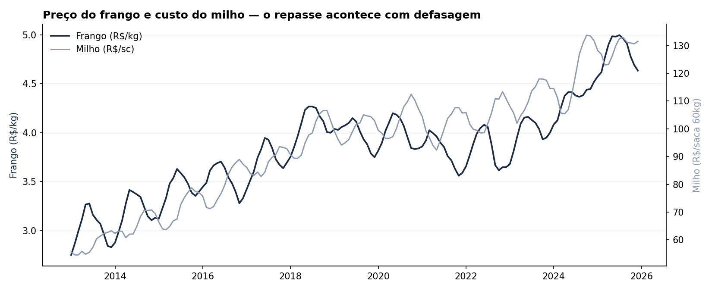
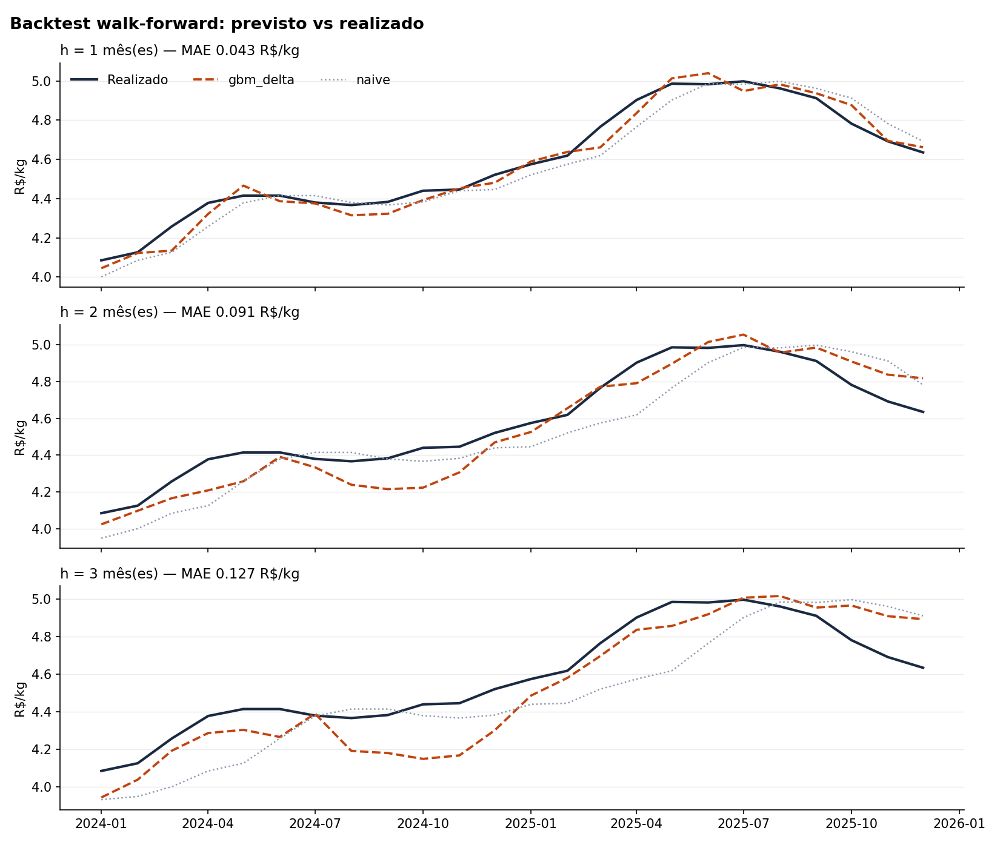
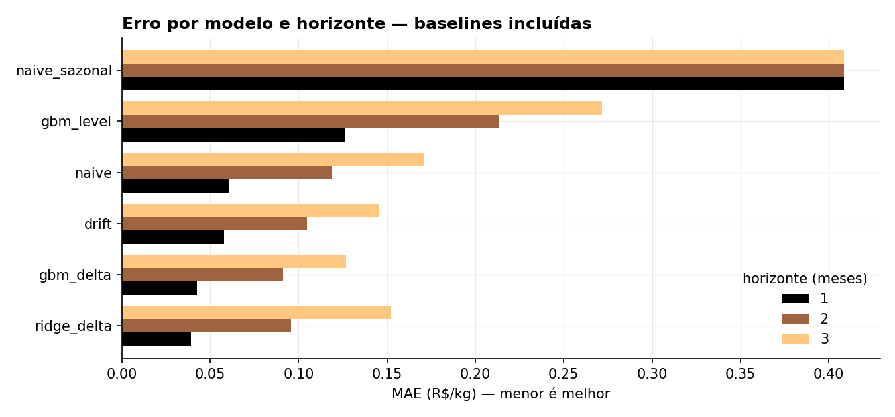

# Broiler Price Forecasting — Brazilian Poultry Market

Monthly broiler (frango) price forecasts 1–3 months ahead, built from feed-cost,
FX and inflation drivers. Walk-forward validated against three baselines,
packaged behind a FastAPI service and shipped with CI.

[](https://github.com/nicollascamargo/previsao-precos-avicultura/actions/workflows/ci.yml)


> **About the data.** The series shipped in this repository are **synthetic**.
> CEPEA/ESALQ does not allow redistribution of its price indicators, so
> `make demo` generates a panel with the same schema and the same causal
> structure as the real one — feed cost passing through to broiler price with a
> 2–4 month lag. `src/precos_avicultura/data/loaders.py` documents every real
> source, its frequency and its aggregation rule, and `build_real_panel()`
> assembles the real thing once you download the files. Every number below is
> therefore a demonstration of **method**, not a claim about the actual market.

---

## Why this problem

A poultry operation buys corn and soybean meal months before the bird it feeds
reaches the slaughterhouse. The producer who fixes feed today is locked into a
cost that only shows up in the margin a quarter later. That lag is not a
nuisance — it is the reason the problem is forecastable at all, and it is what
separates this from a generic price-prediction exercise.

The question the model answers is the one a buyer actually asks: *given what
corn, soy and the exchange rate have done, where is the broiler price likely to
be in one, two and three months, and how wrong has that answer been
historically?*



---

## Results

Expanding-window walk-forward over 24 forecast origins. At every origin the
model is refit from scratch on data whose labels were already observable, then
asked for a single forecast. Baselines see the identical history.

**MASE below 1 means the model beats a seasonal-naive rule; above 1 means ship
the naive rule instead.**

| Horizon | Model | MAE (BRL/kg) | RMSE | sMAPE | MASE | Direction |
|---:|---|---:|---:|---:|---:|---:|
| 1 | **ridge_delta** | **0.039** | 0.046 | 0.87% | **0.22** | 83% |
| 1 | gbm_delta | 0.043 | 0.053 | 0.93% | 0.24 | 87% |
| 1 | drift | 0.058 | 0.072 | 1.24% | 0.33 | 65% |
| 1 | naive | 0.061 | 0.076 | 1.34% | 0.34 | — |
| 1 | gbm_**level** | 0.126 | 0.143 | 2.76% | 0.71 | 39% |
| 2 | **gbm_delta** | **0.091** | 0.109 | 2.03% | **0.51** | 83% |
| 2 | naive | 0.119 | 0.142 | 2.62% | 0.67 | — |
| 2 | gbm_**level** | 0.213 | 0.229 | 4.76% | 1.20 | 38% |
| 3 | **gbm_delta** | **0.127** | 0.151 | 2.83% | **0.72** | 83% |
| 3 | naive | 0.171 | 0.200 | 3.78% | 0.96 | — |
| 3 | gbm_**level** | 0.272 | 0.297 | 6.14% | 1.53 | 46% |

*"Direction" is the share of origins where the sign of the predicted move was
right. The naive forecast never calls a direction, so the metric is undefined
for it rather than zero.*





---

## Three decisions that drive those numbers

### 1. The model predicts the change, not the level

A tree ensemble can only output values it saw during training. Fed prices up to
2021 and asked about 2024, a level-target model is *structurally incapable* of
predicting a price above its historical maximum — it flat-lines at the ceiling.
Modelling `y[t+h] − y[t]` and adding the result back to the last observed price
removes that ceiling entirely.

The `gbm_level` rows in the table are there deliberately: same features, same
data, same hyper-parameters, only the target changes. At h=2 the level model
scores MASE 1.20 — *worse than doing nothing* — while the delta model scores
0.51. This one modelling choice is worth more than any amount of
hyper-parameter tuning, and shipping the comparison is the point.

### 2. A leakage test that actually tests for leakage

`tests/test_features.py::test_features_nao_enxergam_o_futuro` multiplies every
observation after month `t` by a random factor and asserts the feature matrix up
to `t` does not move by more than 1e-12.

If a stray `.shift(-1)` ever enters the feature code, this fails immediately. It
is the only thing standing between an honest backtest and a spectacular,
meaningless R². Column-count assertions do not catch that; this does.

### 3. Refit at every origin, never a random split

A random train/test split on a time series lets the model train on 2024 to
predict 2019. Here, at forecast origin `t` the training set contains only
origins `s` where `s + h ≤ t` — rows whose label was genuinely observable at
prediction time. That is more expensive than fitting once, and it is the only
way the reported error resembles production.

`test_treino_nunca_usa_rotulo_futuro` recomputes that training-set size
independently and compares it against what the backtest loop reported, so the
guarantee is verified rather than asserted in a comment.

---

## Quickstart

```bash
git clone https://github.com/nicollascamargo/previsao-precos-avicultura.git
cd previsao-precos-avicultura
pip install -e ".[dev,stats]"

make demo      # synthetic panel -> walk-forward backtest -> trained artifacts
make test      # 29 tests
make api       # http://localhost:8000/docs
```

`make demo` runs in well under a minute and reproduces every number in the
table above.

### Using real data

Download the source files into `data/raw/` (see the table below), then:

```python
from precos_avicultura.data.loaders import build_real_panel, save_panel

save_panel(build_real_panel("data/raw"))
```

| Column | Source | Frequency | Aggregation |
|---|---|---|---|
| `preco_frango` | CEPEA/ESALQ — frozen broiler indicator (SP) | daily | monthly mean |
| `preco_milho` | CEPEA/ESALQ — corn indicator (Campinas) | daily | monthly mean |
| `preco_soja` | CEPEA/ESALQ — soybean indicator (Paranaguá) | daily | monthly mean |
| `cambio_usdbrl` | Banco Central — SGS series 3698 (PTAX sale) | daily | monthly mean |
| `ipca` | IBGE/SIDRA — table 1737 | monthly | as published |

`validate_panel()` rejects missing months, duplicates and NaNs before anything
touches a model. A silent gap in a monthly index makes every lag feature mean
something different from what its name says, so it fails loudly instead.

---

## API

```bash
curl -X POST http://localhost:8000/prever \
  -H "Content-Type: application/json" \
  -d '{"historico": [ ...at least 25 contiguous months... ], "horizontes": [1,2,3]}'
```

```json
{
  "origem": "2025-12-01",
  "preco_origem": 4.635,
  "previsoes": [
    {
      "horizonte": 3,
      "data_alvo": "2026-03-01",
      "preco_previsto": 4.801,
      "variacao_prevista_pct": 3.58,
      "modelo": "gbm_delta",
      "mae_backtest": 0.127,
      "mase_backtest": 0.715
    }
  ],
  "aviso": "Previsao estatistica para apoio a decisao..."
}
```

Every forecast carries the walk-forward error of the model that produced it. A
point forecast without its historical error is a number pretending to be
information — the caller needs to know that the 3-month number comes with a
±0.13 BRL/kg typical miss before acting on it.

`GET /modelo/{horizonte}` returns the model card: training window, data
fingerprint, measured metrics and top drivers. The service is stateless — the
caller owns the history — which keeps the deployable unit horizontally
scalable and trivially testable.

---

## Repository layout

```
src/precos_avicultura/
├── config.py              schema and hyper-parameter contract, single source of truth
├── data/
│   ├── loaders.py         validation + real-source assembly
│   └── synthetic.py       demo generator with the real causal structure
├── features.py            leakage-safe feature construction
├── models/
│   ├── baselines.py       naive, seasonal naive, drift, SARIMAX
│   ├── forecaster.py      delta-target wrapper around GBM / ridge
│   └── train.py           artifacts + model card
├── backtest.py            expanding-window walk-forward
├── evaluation/metrics.py  MAE, RMSE, sMAPE, MASE, directional accuracy
├── api/                   FastAPI service
└── cli.py                 dados | backtest | treinar
```

CI runs lint and tests on Python 3.10 and 3.12, then runs the entire pipeline
end to end on synthetic data and **fails the build if the model loses to the
naive baseline**. Unit tests can pass while the pipeline is broken; that job is
what catches it.

---

## Limitations

- **Point forecasts only.** A buyer deciding whether to close a contract wants
  an interval. Conformal prediction is the natural next step and is not
  implemented here.
- **Demand side is missing.** Exports, herd cycle and slaughter volume all move
  price and none are in the feature set.
- **No regime-change handling.** A model trained through a stable period will
  miss a sanitary shock or an export ban; the backtest window here contains no
  such event.
- **Monthly granularity** smooths away the within-month volatility a spot buyer
  actually trades against.

---

## License

MIT — see [LICENSE](LICENSE).
